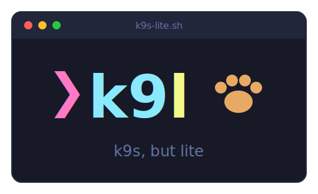
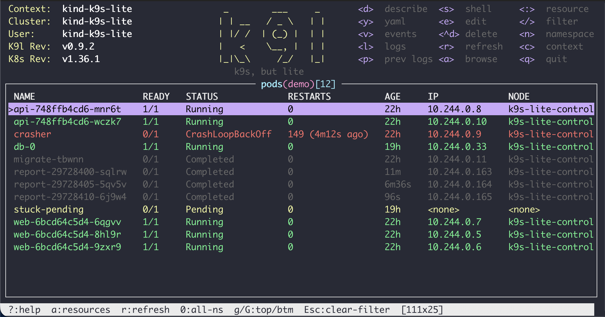

<p align="center">
  
</p>

<p align="center">
  <a href="https://github.com/bguruprasad/k9s-lite/actions/workflows/ci.yml"></a>
  <a href="LICENSE"></a>
  <a href="#requirements"></a>
</p>

# k9s-lite

A [k9s](https://k9scli.io/)-style terminal UI for Kubernetes in **pure Bash + kubectl**.
No Go binary, no tview/tcell, no jq — nothing to install. Built for locked-down
environments (corporate Windows machines with only Git Bash, jump hosts, minimal
containers) where the real k9s isn't available.



The layout is responsive: on wide terminals table columns stretch to fill the
screen, the key map right-aligns to the edge, and the ASCII logo appears in the
header; on narrow screens everything collapses gracefully. Colors follow k9s.
Set `K9L_ASCII=1` for plain `+---+` borders on terminals without Unicode box drawing.

## Why

- **Zero dependencies** beyond `bash` (3.2+), `kubectl`, and the coreutils that ship
  with Git Bash / any Linux / macOS. kubectl does all parsing and auth — including
  corporate SSO/OIDC setups that are painful to reimplement.
- **RBAC-friendly**: designed for users who can only see specific namespaces.
  Nothing requires cluster-wide permissions; when listing namespaces is Forbidden,
  you type the namespace name instead.
- **OpenShift-aware**: run it with `K9L_KUBECTL=oc` — `:routes` works via API
  discovery, and the namespace picker uses RBAC-filtered `projects`.

## Requirements

- bash 3.2+ (macOS system bash works; Git Bash on Windows ships 5.x)
- `kubectl` (or `oc`) on PATH, configured with a kubeconfig
- On Windows/Git Bash: `winpty` for `exec`/`edit` (bundled with Git for Windows)

## Install

```sh
git clone https://github.com/bguruprasad/k9s-lite.git && cd k9s-lite
bash k9s-lite.sh
```

Or copy `k9s-lite.sh` + the `lib/` directory to any box — that's the whole program.

## Usage

```sh
bash k9s-lite.sh                     # namespace from kubeconfig context, else "default"
bash k9s-lite.sh -n my-namespace     # start in a specific namespace
K9L_KUBECTL=oc bash k9s-lite.sh      # OpenShift
K9L_REFRESH=5 bash k9s-lite.sh       # slower refresh (default 2s) for slow VPNs
K9L_DEMO=1 bash k9s-lite.sh          # demo data, no cluster needed
```

## Keys

| Key | Action |
|-----|--------|
| `j`/`k`, arrows, mouse wheel | move cursor |
| `g` / `G`, PgUp / PgDn | top / bottom / page |
| `:` | command mode — switch resource: `:po` `:svc` `:deploy` `:sts` `:cm` `:secret` `:events` `:routes` … any kind or kubectl shortname |
| `a` | resource browser — pick from every kind the cluster supports (`kubectl api-resources`, CRDs included) |
| `/` | filter rows (case-insensitive); `Esc` clears |
| `Enter` | describe rendered inside the box — cyan keys, status-colored values; scroll with j/k, `Esc` back |
| `d` | describe (plain, in pager) |
| `y` | YAML (pager) |
| `v` | events for the selected object, oldest→newest |
| `l` | logs, live follow in `less +F` — `Ctrl-C` stops following (scroll/search), `q` returns |
| `p` | previous-container logs (crash loops) |
| `s` | shell into pod (bash if present, else sh) |
| `e` | `kubectl edit` |
| `Ctrl-D` | delete (asks for confirmation) |
| `n` | namespace picker (typed entry if listing is Forbidden) |
| `c` | context picker (switches kubeconfig current-context) |
| `0` | toggle all-namespaces (needs cluster-wide list RBAC) |
| `?` | help — full key reference rendered in the box |
| `r` | refresh now |
| `q` | quit / cancel |

## Namespace resolution

1. `--namespace <ns>` argument, if given
2. the namespace set on your current kubeconfig context
3. `default`

The view is locked to one namespace unless you explicitly toggle `0`.

## Design

kubectl is the parser: lists are `kubectl get -o wide`, discovery is implicit
(any resource kind kubectl knows works in `:` command mode — CRDs and OpenShift
routes included), sorting/filtering of events uses `--sort-by`. The UI is raw
ANSI escapes with a full redraw per tick; the event loop is a single
`read -t <refresh>` — the timeout doubles as the polling timer. Interactive
actions (logs, exec, edit, pagers) suspend the alt screen, hand the real
terminal to the child, and restore raw mode after. Pager-based views (describe,
yaml, logs) leave no trace in your shell's scrollback; `s` (exec) and `e` (edit)
deliberately run on the normal screen so your session transcript survives.

See [PLAN.md](PLAN.md) for the full design and milestone history.

### Windows / Git Bash specifics

- Interactive kubectl (`exec -it`, `edit`) is wrapped with `winpty` automatically
  under mintty.
- All kubectl output is stripped of `\r`; the repo enforces LF endings.
- Terminal size is polled every tick (mintty doesn't deliver SIGWINCH to bash).
- No subshells in the render loop — process forks are expensive under Git Bash.

## Development

Local test cluster (kind on podman or docker):

```sh
kind create cluster --name k9s-lite          # KIND_EXPERIMENTAL_PROVIDER=podman if using podman
kubectl apply -f hack/sample-resources.yaml  # healthy/crashing/pending pods, jobs, services…
bash k9s-lite.sh -n demo
```

Tests drive the real TUI in a pseudo-terminal (`script(1)`), feed it key bytes,
and assert on the rendered frames — see PLAN.md.

## License

[MIT](LICENSE)
